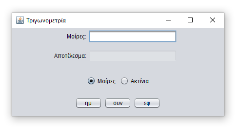
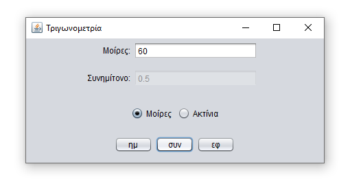
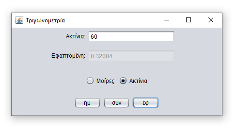

# Τριγωνομετρία
 
Στην εργασία αυτή έχει δημιουργηθεί ένας μικρός υπολογιστής τριγωνομετρικών συναρτήσεων. Η μορφή που έχει το πρόγραμμα είναι η εξής:

# Σημειώσεις - Παρατηρήσεις

- Στην εφαρμογή έχουν προβλεφθεί διάφορα λάθη που μπορεί να προκύψουν. Π.χ. βγαίνει κατάλληλο μήνυμα λάθους στην περίπτωση που δεν υπολογίζεται η εφαπτομένη (90 μοίρες).
- Οταν ο χρήστης ζητάει συγκεκριμένο υπολογισμό αλλάζει αντίστοιχα και το κείμενο της δεύτερης ετικέτας (π.χ. σε «Συνημίτνον:» ή «Εφαπτομένη:»).
- Παρομοίως, όταν ο χρήστης αλλάζει μονάδα μέτρησης αλλάζει αντίστοιχα και το κείμενο της πρώτης ετικέτας (π.χ. σε «Ακτίνια:»). Επίσης τότε γίνεται πάλι ο υπολογισμό που είχε ζητηθεί (αν είχε ζητηθεί), με τη νέα μονάδα μέτρησης.
- Οταν το παράθυρο αλλάζει μέγεθος, τα γραφικά στοιχεία παραμένουν στο κέντρο του παραθύρου, στοιχισμένα όπως φαίνεται στις εικόνες.

# Φωτογραφίες

## 📝 &nbsp; License - Άδεια

The project is available as open source under the terms of the MIT License.

- **[MIT license](http://opensource.org/licenses/mit-license.php)**
- Copyright 2020 © <a href="https://github.com/NasosG" target="_blank">NasosG</a>.
